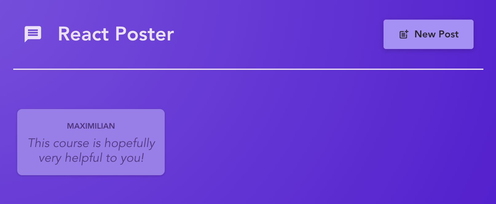
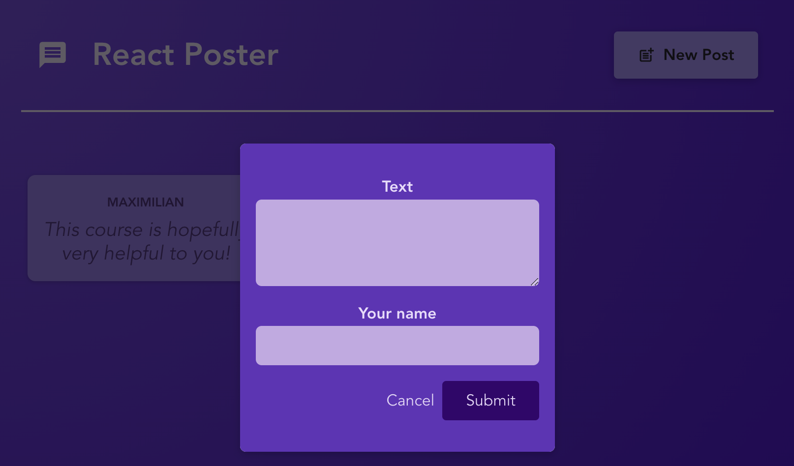

## React Poster

Example project following the **Next.js 15 & React - The Complete Guide** based on [Maximilian Schwarzmüller's Udemy course](https://www.udemy.com/course/react-the-complete-guide-incl-redux).

## React Poster Demo

- `useLoaderData`: Used in PostDetails and PostList components to access data loaded by the route loader functions
- `useNavigate`: Used in Modal component for programmatic navigation

## Screenshots

Posts Home

Posts Dialog

